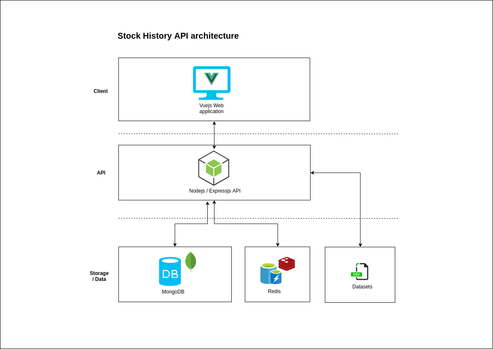

# Stock History API

Stock History API is nodejs service that expose an API serving the stock history of AMEX, NASDAQ and NYSE from 1970 to 2019. 


Thanks to a dataset provided by [Jiun Yen](https://github.com/qks1lver) on Kaggle, this project imports the data from more than 8000 csv files to a mongodb database.

In order to prevent to many hits in the database, this project uses Redis to cache results for 30 minutes until it expires.

## Architecture



## Project structure

```
stock-history
  node_modules
  src
    /controllers
    /database
    /etl
    /middlewares
    /models
    /routes
    /swagger
    application.js
  test
    /controllers
    /dataset
    /etl

```

## Running in your local machine

To run this project in your machine you will need these assets and tools installed:

* Nodejs >= 10.11.0
* MongoDB >= 4.0.9
* Redis >= 5.0.4
* [Dataset: NASDAQ and NYSE stocks histories](https://www.kaggle.com/qks1lver/amex-nyse-nasdaq-stock-histories)

## Getting started

1 - Clone this repository

``` git clone  git@github.com:flowck/stock-history-api.git```

2 - Install the dependencies with your favourite package manager

``` cd stock-history-api ```

``` npm i ```

or 

``` yarn ```

3 - Create at least two mongodb databases

``` stockHistoryService ```

and 

``` stockHistoryService_test ```

4 - Update the ```./config.js``` file in the root of the project with your db credentials and the path pinting to where you have extracted the dataset .csv files.

```
dev: {
  SERVER_NAME: "localhost",
  DB_NAME: "stockHistoryService",
  DATASET: "/path/to/dataset"
}
```

5 - Import the dataset. It should take a while to process it.

``` npm run dataset:import ```

6 - Run the api

``` npm start ```

## API documentation

This project uses OpenAPI and Swagger to generate the documentation.

``` http://localhost:3000/api/docs ```

## Cleaning the dataset from the database

``` npm run dataset:clean ```

## Running tests

``` npm run test ```

## Running prettier

This project uses prettier, and to enable the auto-fix you just need to run the command bellow in your terminal while writing code:

``` npm run p:w ```

## Acknowledgements

[Jin Yen](https://github.com/qks1lver)

## License 

MIT License - [Firmino Changani](https://github.com/flowck)